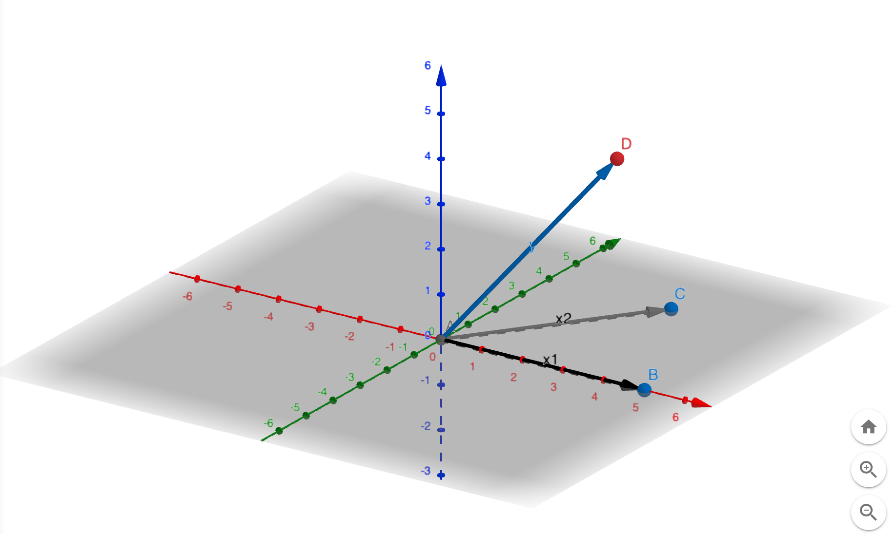

```{r setup, include=FALSE}
knitr::opts_chunk$set(echo = TRUE)
```

### Set Up

```{r set_up}
x1 = c(5, 0 , 0)
x2 = c(3, 4, 0)
y = c(3, 2, 4)
```

### Plot 
{width=50%}

I created this plot in https://www.geogebra.org/3d?lang=en

### Multivariate Regression  
```{r multivariate}
fit <- lm(y ~ x1 + x2)
summ <- summary(fit)
summ
```

> We see the Beta2 is **-0.5**

### Univariate Regression to obtain Beta2 
#### Step 1: Regress y onto x1 to obtain **epsilon_y ~ x1**
```{r univariate_1}
fit1 <- lm(y ~ x1)
summ1 <- summary(fit1)
summ1
EpsilonY_x1 <- summ1$residuals
```

#### Step 2: Regress x2 onto x1 to obtain **epsilon_x2 ~ x1**
```{r}
fit2 <- lm(x2 ~ x1)
summ2 <- summary(fit2)
summ2
Epsilonx2_x1 <- summ2$residuals
```

#### Step 3: Regress [epsilon_y ~ x1] onto [epsilon_x2 ~ x1] to obtain **Beta2**
```{r warning = FALSE}
fit3 <- lm(EpsilonY_x1 ~ Epsilonx2_x1)
summ3 <- summary(fit3)
summ3$coefficients
```

> Univariate regression also gives us **-0.5**